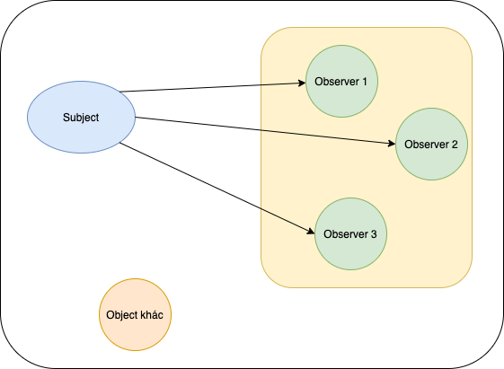
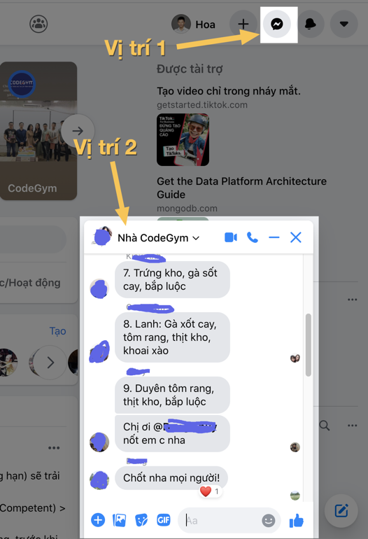
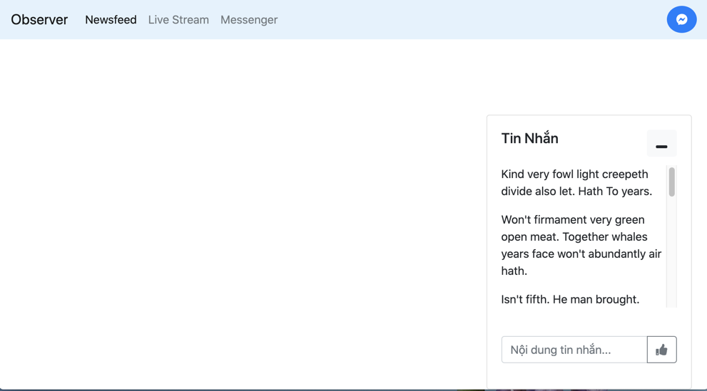
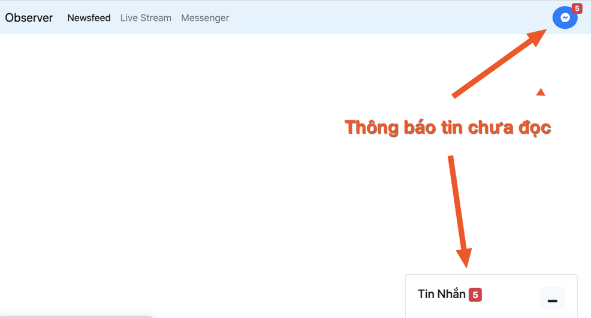

# Sử dụng Observer pattern trong JavaScript

Với chủ đề "Design Patterns" của **Tạp Chí Lập Trình** Vol.6, tác giả muốn giới thiệu với các bạn về Observer pattern. Đây là một pattern khá hữu ích cho các dự án web nói chung và dự án ngôn ngữ lập trình JavaScript nói riêng. Qua kinh nghiệm làm việc, tác giả nhận thấy pattern này giải quyết được nhiều tình huống thường gặp. Để đọc hiểu bài viết này, bạn đọc cần có một số kiến thức cơ bản sau:

* Có hiểu biết cơ bản về Design Pattern
* Nắm vững cú pháp cơ bản trong JavaScript

## Giới thiệu

### Khái niệm

Observer pattern là một pattern trong thiết kế phần mềm, trong đó có một đối tượng được gọi là Subject (chủ thể) có nhiệm vụ quản lý các đối tượng phụ thuộc (được gọi là Observer). Khi trạng thái của Subject thay đổi, Subject sẽ thông báo đến các Observer thông qua cơ chế do Observer cung cấp. Pattern này nằm trong nhóm Behavioral (Hành vi) - nhóm giải quyết các vấn đề tương tác giữa các đối tượng với nhau.

Triển khai Observer khá đơn giản. Có 2 thành phần chính cần được xây dựng:

*    Subject: Là chủ thể của trạng thái dữ liệu. Đối tượng này duy trì danh sách các đối tượng phụ thuộc khác (được gọi là Observers) và thông báo cho các đối tượng đó khi trạng thái dữ liệu thay đổi. Ví dụ: nhận tin nhắn mới từ máy chủ, người dùng click vào vị trí nào đó trên giao diện,...
*    Observer: Thành phần nhận thông báo từ Subject và thực hiện những hành vi tương ứng.



Quan sát hình mình hoạ ở trên, các bạn có thể thấy một đối tượng Subject có mối quan hệ đến những đối tượng Observer trong vùng màu vàng. Khi Subject có sự thay đổi hoặc cập nhật, các Observer sẽ nhận được thông báo. Còn "Object khác" không phải là Observer nên sẽ không nhận được cập nhật từ Subject.

### Ý nghĩa

Như đã trình bày, một Observer có thể được gán hoặc xoá khỏi danh sách trong Subject. Việc này giúp mã nguồn linh hoạt hơn khi xử lý các tình huống gửi thông báo. Đôi khi bạn sẽ gặp trường hợp như: có một thông báo được phép gởi đồng loạt cho tất cả observer, và thông báo khác thì chỉ gửi tới một số lượng hạn chế các observer liên quan.

Ví dụ tình huống sau:

*    Khi bạn chuyển khoản thành công trên hệ thống Internet Banking, hệ thống có thể gửi thông báo đồng loạt đến các kênh:
     *    Tin nhắn điện thoại (SMS)
     *    Email cá nhân
     *    Thông báo trên mobile app (Notification)
*    Tuy nhiên, với chức năng xác thực để chuyển khoản, nếu ngân hàng mà bạn sử dụng có dùng giải pháp OTP (One-Time Password) thì tin nhắn chứa mã OTP sẽ chỉ gửi đến tin nhắn di động, mà không gửi qua email hoặc notification của mobile app.

### Triển khai với JavaScript

Trong thế giới các ngôn ngữ lập trình Hướng đối tượng (OOP) như Java, C#,... triển khai mẫu này cần có các Interface phục vụ mục đích giảm tính phụ thuộc giữa các thành phần trong ứng dụng:

Thành phần | Mô tả 
-- | --
Subject | Là một interface khai báo các phương thức quản lý danh sách các Observer 
Observer	| Là interface cung cấp cơ chế cập nhật trạng thái từ Subject 
ConcreteSubject | Triển khai mã cụ thể cho interface Subject 
ConcreteObserver	| Triển khai mã cụ thể cho interface Observer 

Với ngôn ngữ JavaScript, mặc dù một số từ khoá theo mô hình OOP (như class, extends) vẫn được hỗ trợ, nhưng lại thiếu cơ chế abstraction như abtract class, interface. Vậy nên, việc triển khai Observer pattern sẽ hơi khác so với các hướng dẫn dành cho OOP. Phần triển khai cụ thể sẽ được trình bày chi tiết hơn ở mục **Giải pháp** (Xây dựng demo).

## Tình huống

Để giải thích pattern này dễ hiểu nhất có thể, tác giả mượn một tình huống khá quen thuộc trong ứng dụng mạng xã hội Facebook. Đó là cửa sổ chat Messenger khi người dùng lướt Newsfeed như hình ảnh dưới đây:



Ở hình trên, tác giả đánh dấu **hai vị trí cần lưu ý**:

*    **Vị trí thứ nhất** là thông báo số tin nhắn mới từ Messenger.
*    **Vị trí thứ hai** là cửa sổ chat Messenger khi người dùng lướt Newsfeed. Nếu ở dạng rút gọn (minimize) thì vị trí này sẽ hiển thị số tin mới chưa được đọc (giống **vị trí thứ nhất**).

Khi người dùng đọc các tin mới, số tin nhắn ở cả hai vị trí đều được reset và ẩn đi. Trong tình huống người dùng đang lướt newsfeed và có tin nhắn mới, số tin nhắn mới sẽ được cập nhật ở cả hai vị trí trên.

Chúng ta bắt đầu xây dựng tính năng này.

Trước hết, cần có một layout đơn giản với Bootstrap để mô phỏng lại tính năng trên.



Thông báo khi thu gọn cửa sổ tin nhắn:



Mục tiêu của bài viết là demo được cách sử dụng Observer pattern, nên phần giao diện sẽ không được chú trọng. Bạn đọc có thể cải tiến thêm. Mã nguồn layout khá dài và chưa liên quan trực tiếp đến nội dung bài viết nên tác giả sẽ không mô tả tại đây. Các bạn có thể thao khảo mã nguồn đầy đủ ở gần cuối bài viết.

## Giải pháp

Với tình huống trên, chúng ta có thể thấy rằng: hành vi cập nhật giao diện ở cả hai vị trí đều liên quan đến tình huống nhận tin nhắn mới từ máy chủ. Thoạt nhìn, tính năng có vẻ khá đơn giản. Nhưng nếu không phân tích kĩ một số góc cạnh khi thiết kế và viết mã, chúng ta có thể sẽ viết nên một khối mã nhập nhằng, khó đọc và khó bảo trì. Mẫu Observer phù hợp để giải quyết những tình huống như vậy.

Để triển khai mẫu này, chúng ta sẽ làm các thao tác như sau:

### Bước 1 - Khai báo class Subject

```javascript
class Subject {
  constructor() {
    this.observers = [];
  }

  subscribe(observer) {
    this.observers.push(observer);
  }

  unsubscribe(observer) {
    this.observers = this.observers.filter(subscriber => subscriber !== observer);
  }

  notify(params) {
    this.observers.forEach(observer => observer.update(params));
  }
}
```

<u>Giải thích mã:</u> Class Subject ở trên có 3 phương thức:

*    Phương thức `subscribe` được sử dụng để gán một hành vi, hoặc một thành phần observer vào.
*    Phương thức `unsubscribe` được sử dụng để huỷ một hành vi, hoặc một thành phần observer khỏi danh sách.
*    Phương thức `notify` có nhiệm vụ thông báo đến toàn bộ observer về trạng thái mới (hoặc sự kiện mới xảy ra).

Với ngôn ngữ lập trình JavaScript, chúng ta sử dụng kỹ thuật callback. Các observer sẽ lưu lại những function callback để có thể được thực hiện hành vi tương ứng khi sự kiện xảy ra.

Lưu ý thêm: Nếu bạn quen thuộc với những các ngôn ngữ lập trình hướng đối tượng, bạn có thể áp dụng cơ chế interface để xác định một đối tượng là Observer. Tuy nhiên, cơ chế này không tồn tại trong JavaScript nên đây là giải pháp gần gũi và dễ thực hiện nhất.

### Bước 2 - Khai báo các Observer

Như đã giải thích ở bước 1, chúng ta sử dụng cơ chế callback. Vì vậy các function dưới đây sẽ được khai báo để đảm trách vai trò thực hiện những hành vi cụ thể khi sự kiện diễn ra. Với tình huống demo mà chúng ta đang thực hiện, mã nguồn có thể được viết như sau:

1.   Các function tương tác với giao diện khi cập nhật dữ liệu, bao gồm tin nhắn mới và số tin nhắn chưa đọc:

```javascript
function render_chat_message({ message }) {
  document.getElementById(chat_lines).appendChild(render_one_line(message));
}

function render_unread_count_header({ unread_state }) {
  document.getElementById(header_badge).innerText = unread_state.get_string();
}

function render_unread_count_chatbox({ unread_state }) {
  document.getElementById(chat_box_badge).innerText = unread_state.get_string();
}

function reset_unread_notification_ui() {
  document.getElementById(header_badge).innerText = "";
  document.getElementById(chat_box_badge).innerText = "";
}
```

2.   Khai báo một class Observer để wrap các function này thành callback:

```javascript
class Observer {
  constructor(callback) {
    this.callback = callback;
  }

  update(params) {
    this.callback(params);
  }
}

const chatbox_content_observer        = new Observer(render_chat_message);
const chatbox_unread_notify_observer  = new Observer(render_unread_count_chatbox);
const header_unread_notify_observer   = new Observer(render_unread_count_header);
```

### Bước 3 - Cập nhật danh sách Observer trong Subject

Chúng ta khởi tạo một đối tượng kiểu Subject, với tên là `message_receiver`. Sau đó, lần lượt gán ba observer được khai báo ở bước 2 vào `message_receiver`. 

```javascript
const message_receiver = new Subject();

message_receiver.subscribe(chatbox_content_observer);
message_receiver.subscribe(chatbox_unread_notify_observer);
message_receiver.subscribe(header_unread_notify_observer);
```

Mỗi khi sự kiện tin nhắn mới diễn ra, chúng ta sẽ gọi phương thức `notify` để thông báo đến ba observer đã gán.

```typescript
const socket = io(chat_server_url);
socket.on(NEW_MESSAGE, (msg) => {
  unread_state.increase();
  message_receiver.notify(msg);
});
```

<u>Chú thích</u>: Trong demo này, tác giả sử dụng Socket.IO, một thư viện JavaScript giúp gửi và nhận thông điệp theo thời gian thực. Thư viện này sử dụng giao thức Web Socket để làm việc. Dòng mã `const socket = io(chat_server_url)` phục vụ tạo ra một kết nối đến Chat Server (mã nguồn sẽ được kèm trong link bên dưới).

### Bước 4 - Bổ sung tình huống

Ở tình huống cửa sổ chat đang mở và được focus, các tin nhắn mới sẽ được hiển thị,  người dùng đọc được nên ứng dụng không cần phải thông báo số tin nhắn chưa đọc nữa. Vì vậy, chúng ta sẽ xoá các observer liên quan đến thông báo số lượng tin chưa đọc khỏi subject. Đoạn mã này được viết lại như sau:

```javascript
message_receiver.subscribe(chatbox_content_observer);

function hide_unread_notification() {
  message_receiver.unsubscribe(chatbox_unread_notify_observer);
  message_receiver.unsubscribe(header_unread_notify_observer);
}

function show_unread_notification() {
  message_receiver.subscribe(chatbox_unread_notify_observer);
  message_receiver.subscribe(header_unread_notify_observer);
}
```

Đồng thời, các hàm này được gọi ở sự kiện click vào button phóng to/thu gọn cửa sổ chat:

```javascript
document.getElementById(chatbox_toggle).addEventListener('click', _ => {
  chatbox_ui.toggle();
  unread_state.reset();
  if (chatbox_ui.is_maximize()) {
    hide_unread_notification();
    reset_unread_notification_ui();
  } else {
    show_unread_notification();
  }
});
```

### Mã nguồn

Các bước ở trên chỉ là những đoạn mã rời rạc giúp người đọc hình dung được cách triển khai Observer pattern. Để ứng dụng demo có thể chạy được, mã nguồn cần được bổ sung hoàn chỉnh và cấu trúc tốt hơn.

Toàn bộ mã nguồn (bao gồm cả demo chat server và demo layout) được lưu trữ tại đây để các bạn có thể tham khảo và cải tiến: https://github.com/hoadh/tutorial-observer-pattern-javascript

Sau khi clone repository về, các bạn chạy lệnh sau để cài đặt các gói cần thiết cho demo server:

```bash
cd src/server
npm i
```

Khởi động server:

```bash
node server.js
```

Cuối cùng, mở file `index.html` (trong thư mục `src/client`) bằng trình duyệt để thực hiện tính năng được mô tả trong bài viết.

## Kết bài

Hy vọng bài viết này có thể mang lại cho người đọc những kiến thức hữu ích về Observer pattern. Qua đó, có thể áp dụng được và nâng cao chất lượng công việc hằng ngày. Observer chỉ là một trong số rất nhiều design pattern mà chúng ta có thể áp dụng giúp nâng cao chất lượng mã nguồn. Tác giả gợi ý một số tài nguyên dưới đây để bạn có thể tìm hiểu bài bản hơn về chủ đề này:

*    Sách "Head First Design Patterns" (Tác giả: Eric Freeman, Elisabeth Robson, Bert Bates, Kathy Sierra). Link: https://www.amazon.com/_/dp/0596007124
     Sách có nhiều hình ảnh minh hoạ, giúp bạn dễ dàng hình dung được vấn đề mà pattern được đề cập giải quyết là gì, cũng như cách hoạt động của nó.
*    Sách "Learning JavaScript Design Patterns" (Tác giả: Addy Osmani). Link: https://addyosmani.com/resources/essentialjsdesignpatterns/book/
     Đây là quyển sách phù hợp cho các lập trình viên sử dụng ngôn ngữ JavaScript trong công việc hằng ngày.

Tác giả rất mong muốn nhận được phản hồi về nội dung bài viết, cũng như có được những thảo luận sâu hơn để nâng cấp kiến thức của bản thân. Chúc các bạn luôn tìm thấy được những niềm vui khi học và làm lập trình!